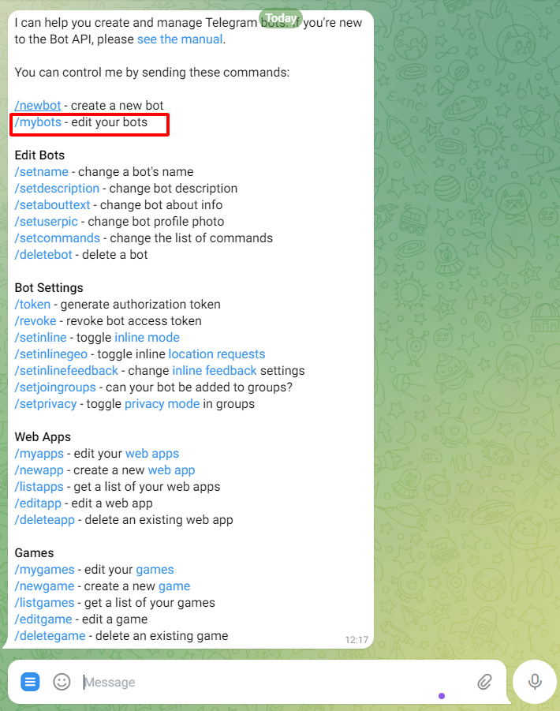
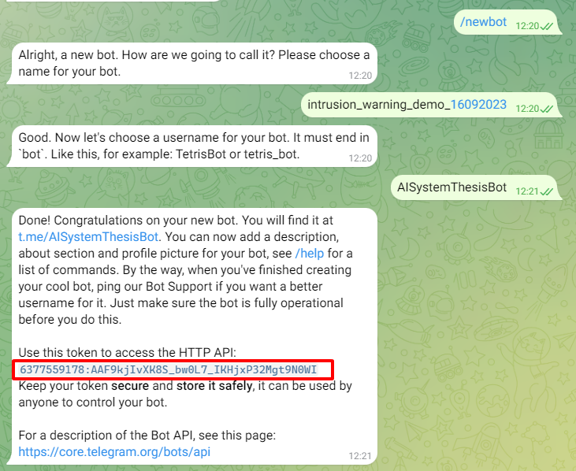
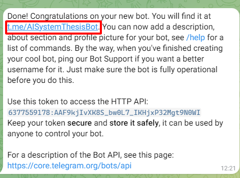
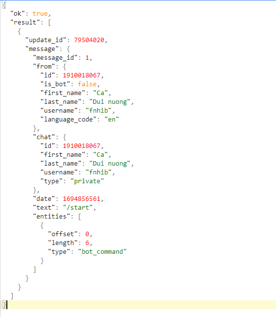
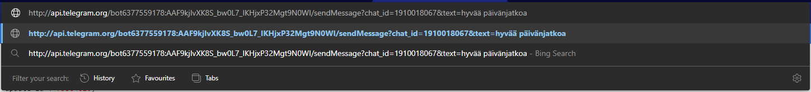
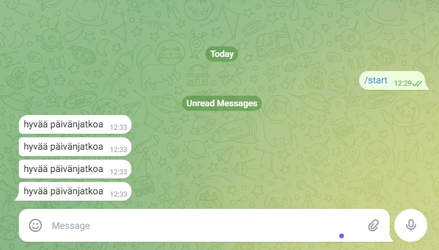

# 1. Create a Telegram account

# 2. Create a Telegram bot with BotFather (verified)

    ## 2.1. BotFather (verified):

    

    ## 2.2. Click to start button:

    

    ## 2.3. Create new bot:

    

    ## 2.4. Set Bot information and get token of our bot:

    

# 3. Create a group chat and get chat ID of user

- Make a warning: When you need to send a warning to a person, you need to have the chat ID of that person

  ## 3.1. Access for chatting to the bot so that Telegram API could fetch our data information

  

  ## 3.2. After click to the start button:

  GET USER ID here:
  http://api.telegram.org/bot[TOKEN]/getUpdates
  

  SEND Message to the User through(optional):
  http://api.telegram.org/bot[TOKEN]/sendMessage?chat_id=[CHAT_ID]&text=[MY_MESSAGE_TEXT]
  
  

# 4. Add library python-telegram-bot or aiogram

# 5. Write code to send text and image
